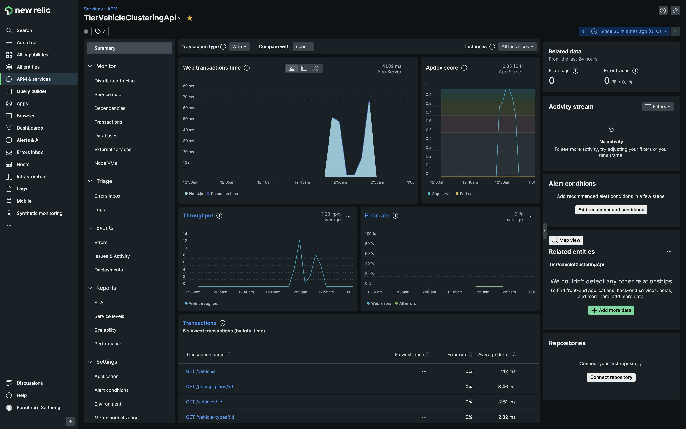
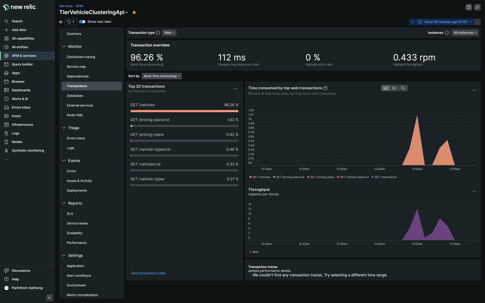

# Tier Vehicle Clustering API
## Description
The main purpose of this service is to provide the data via an API to visualize vehicle clusters on a map. It should also allow users to filter vehicles (e.g., based on availability, location, or other attributes) by passing parameters.

The downstream data for this service is obtained from Tier publicly available API endpoints based on the GBFS standard: https://data-sharing.tier-services.io/tier_paris/gbfs/2.2

## Prerequisites
- Docker and Docker Compose
- [Optional] New Relic license key for app instrumentation. See [here](https://docs.newrelic.com/docs/apm/agents/nodejs-agent/installation-configuration/install-nodejs-agent-docker) for New Relic documentation.

## Installation
1. [Optional] Add your New Relic license key to [`docker-compose.yml`](./docker-compose.yml)
```yml
...
  environment:
    PORT: 3001
    NEW_RELIC_LICENSE_KEY: "<NEW_RELIC_LICENSE_KEY>"
...
```
2. Run a following command to start the server
```bash
$ docker compose up
```
3. The app should be up and running at http://localhost:3001

## Technical Design
 As the payload for a bike status is quite large, the service is designed to periodically cache data from the downstream API. This is to improve the client's response time. 

The data from the downstream API is periodically cached with regard to `ttl` and `lasted_updated` fields returned in a Tier GBFS response. In this service, we require data from three different endpoints (see [Exploring Tier API](#exploring-tier-api)). For the sake of maintainability, [`TierGBFSInternalCacheGenericRepository`](./src/core/repository/tier-gbfs-internal-cache-generic-repository.ts) is defined to be a generic repository to internally cache and synchronize data from a downstream endpoint. 

This is sufficient as a starting point. When the service is horizontally scaled up, we can introduce a new distributed cache layer to minimize load on the downstream API.  

### Available Endpoints
- GET /vehicles
  - Query parameters
      - `lat` (optional): Latitude of a location where you want to search for vehicles.
      - `lon` (optional): Longitude of a location where you want to search for vehicles.
      - `search_radius` (optional): Radius of the search zone in meter. If `search_redius` is `0` or not provided, all vehicles will be returned.
      - `vehicle_type_ids` (optional): a comma-separated list of vehicle type IDs.
      - `minimum_range_meters` (optional)
      - `reserved` (optional)
      - `disabled` (optional)
- GET /vehicles/:id
- GET /vehicle-types
- GET /vehicle-types/:id
- GET /pricing-plans
- GET /pricing-plans/:id

## Metrics & Instrumentation
If a New Relic license key is provided, the data captured from the application should start showing up on your New Relic dashboard. To see the data reported, you must first generate some load and wait for 2-3 minutes.



## Exploring Tier API

**Free Bike Status**

GET: [https://data-sharing.tier-services.io/tier_paris/gbfs/2.2/free-bike-status](https://data-sharing.tier-services.io/tier_paris/gbfs/2.2/free-bike-status)

```json
{
  "last_updated": 1667560086,
  "ttl": 0,
  "version": "2.2",
  "data": {
    "bikes": [
      {
        "bike_id": "1d0ed091de0cc284ab271cc745653ee03d17f0160e14cb2b103b750eaa448959",
        "lat": 48.887627,
        "lon": 2.344614,
        "is_reserved": false,
        "is_disabled": false,
        "vehicle_type_id": "escooter_paris",
        "current_range_meters": 25000,
        "pricing_plan_id": "a4d5e9f0-3f82-459b-901f-41ef42fd2402",
        "rental_uris": {
          "android": "https://tier.page.link/Vbaff",
          "ios": "https://tier.page.link/Vbaff"
        }
      },
      {
        "bike_id": "ea53de4f1c807e3edd38634db303148331864a3a46694fb37380f30b71b34d76",
        "lat": 48.831505,
        "lon": 2.297049,
        "is_reserved": false,
        "is_disabled": false,
        "vehicle_type_id": "escooter_paris",
        "current_range_meters": 20000,
        "pricing_plan_id": "a4d5e9f0-3f82-459b-901f-41ef42fd2402",
        "rental_uris": {
          "android": "https://tier.page.link/Vbaff",
          "ios": "https://tier.page.link/Vbaff"
        }
      },
      {
        "bike_id": "890e2a220dada230f17887626a50454f20c206f5a67547dd650665e4b211c2a0",
        "lat": 48.884611,
        "lon": 2.359373,
        "is_reserved": false,
        "is_disabled": false,
        "vehicle_type_id": "escooter_paris",
        "current_range_meters": 40000,
        "pricing_plan_id": "a4d5e9f0-3f82-459b-901f-41ef42fd2402",
        "rental_uris": {
          "android": "https://tier.page.link/Vbaff",
          "ios": "https://tier.page.link/Vbaff"
        }
      },
      {
        "bike_id": "9a23b722c699712d706197a7a7a4dee2cec6385f0c6491f6680e154788c09e4d",
        "lat": 48.864143,
        "lon": 2.406823,
        "is_reserved": false,
        "is_disabled": false,
        "vehicle_type_id": "escooter_paris",
        "current_range_meters": 46000,
        "pricing_plan_id": "a4d5e9f0-3f82-459b-901f-41ef42fd2402",
        "rental_uris": {
          "android": "https://tier.page.link/Vbaff",
          "ios": "https://tier.page.link/Vbaff"
        }
      },
      {
        "bike_id": "f2bafb5d2e067ae94087cd1675743dae734ca394c9ead44bcac4725d0aa1b87b",
        "lat": 48.823609,
        "lon": 2.322425,
        "is_reserved": false,
        "is_disabled": false,
        "vehicle_type_id": "escooter_paris",
        "current_range_meters": 35000,
        "pricing_plan_id": "a4d5e9f0-3f82-459b-901f-41ef42fd2402",
        "rental_uris": {
          "android": "https://tier.page.link/Vbaff",
          "ios": "https://tier.page.link/Vbaff"
        }
      },
      {
        "bike_id": "cf7c36893468e0a7d99b2dd83209225e1aaef74d968fa6a121b6fe3a6c39b71b",
        "lat": 48.865055,
        "lon": 2.286644,
        "is_reserved": false,
        "is_disabled": false,
        "vehicle_type_id": "escooter_paris",
        "current_range_meters": 34000,
        "pricing_plan_id": "a4d5e9f0-3f82-459b-901f-41ef42fd2402",
        "rental_uris": {
          "android": "https://tier.page.link/Vbaff",
          "ios": "https://tier.page.link/Vbaff"
        }
      },
      {
        "bike_id": "b9a3820e3b0fa4fe076ea183031bd909bc9a02a5f695ece151d4e26a8acd0a90",
        "lat": 48.844497,
        "lon": 2.32988,
        "is_reserved": false,
        "is_disabled": false,
        "vehicle_type_id": "escooter_paris",
        "current_range_meters": 34000,
        "pricing_plan_id": "a4d5e9f0-3f82-459b-901f-41ef42fd2402",
        "rental_uris": {
          "android": "https://tier.page.link/Vbaff",
          "ios": "https://tier.page.link/Vbaff"
        }
      },
      {
        "bike_id": "acafb86b241e5ed3487e672dba14cd3c02bd6cbbaf3f9ea7be1c17079e56c7fc",
        "lat": 48.855327,
        "lon": 2.395539,
        "is_reserved": false,
        "is_disabled": false,
        "vehicle_type_id": "escooter_paris",
        "current_range_meters": 31000,
        "pricing_plan_id": "a4d5e9f0-3f82-459b-901f-41ef42fd2402",
        "rental_uris": {
          "android": "https://tier.page.link/Vbaff",
          "ios": "https://tier.page.link/Vbaff"
        }
      }
    ]
  }
}
```


**Vehicle Types**

GET: [https://data-sharing.tier-services.io/tier_paris/gbfs/2.2/vehicle-types](https://data-sharing.tier-services.io/tier_paris/gbfs/2.2/vehicle-types)

```json
{
  "last_updated": 1667560860,
  "ttl": 60,
  "version": "2.2",
  "data": {
    "vehicle_types": [
      {
        "vehicle_type_id": "escooter_paris",
        "form_factor": "scooter",
        "propulsion_type": "electric",
        "max_range_meters": 55000,
        "name": "Electric Scooter"
      },
      {
        "vehicle_type_id": "ebicycle_paris",
        "form_factor": "bicycle",
        "propulsion_type": "electric_assist",
        "max_range_meters": 90000,
        "name": "Electric Bicycle"
      }
    ]
  }
}
```


**System Pricing Plans**

GET: [https://data-sharing.tier-services.io/tier_paris/gbfs/2.2/system-pricing-plans](https://data-sharing.tier-services.io/tier_paris/gbfs/2.2/system-pricing-plans)

```json
{
  "last_updated": 1667561044,
  "ttl": 60,
  "version": "2.2",
  "data": {
    "plans": [
      {
        "plan_id": "a4d5e9f0-3f82-459b-901f-41ef42fd2402",
        "name": "scooter-standard-pricing-paris",
        "currency": "EUR",
        "price": 1,
        "is_taxable": false,
        "description": "Standard pricing for scooters, 1.00 EUR to unlock, 0.25 EUR per minute to rent",
        "per_min_pricing": [
          {
            "start": 0,
            "rate": 0.25,
            "interval": 1
          }
        ]
      },
      {
        "plan_id": "cdc8a5b2-75b0-4cac-873d-85734b89c625",
        "name": "bike-standard-pricing-paris",
        "currency": "EUR",
        "price": 1,
        "is_taxable": false,
        "description": "Standard pricing for bikes, 1.00 EUR to unlock, 0.25 EUR per minute to rent",
        "per_min_pricing": [
          {
            "start": 0,
            "rate": 0.25,
            "interval": 1
          }
        ]
      }
    ]
  }
}
```

